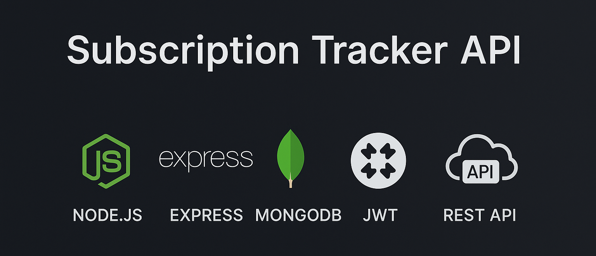

<div align="center">
    <br />
        
    <br />
  
  <div>
    
    
    
    
    
    
    
    
  </div>
</div>

---

<h3 align="center">🚀 Production-Ready Subscription Tracker API</h3>

A scalable and secure **backend service** for managing recurring subscriptions. This RESTful API allows users to authenticate, manage subscription plans, receive email reminders, and store data reliably using a MongoDB database.

---

## 📚 <a name="table">Table of Contents</a>

1. 📌 [Introduction](#introduction)
2. 🎯 [Features](#features)
3. 🛠️ [Tech Stack](#tech-stack)
4. ⚙️ [Setup Instructions](#setup-instructions)
5. 🔐 [Environment Variables](#environment-variables)
6. 📄 [License](#license)

---

## <a name="introduction">📌 Introduction</a>

Build a **production-ready Subscription Management System API** that handles **real users, real money, and real business logic**.

Authenticate users using JWTs, connect a database, create models and schemas, and integrate it with ORMs. Structure the architecture of your API to ensure scalability and seamless communication with the frontend.

---

## <a name="features">🎯 Features</a>

1. 🔐 **JWT Authentication** – Secure login and registration flow.
2. 🧠 **Smart Subscription Management** – Track services, renewal dates, categories, and payment methods.
3. 📬 **Automated Email Reminders** – Scheduled email notifications using **Upstash QStash**.
4. 🌐 **RESTful Architecture** – Clean and consistent routing design.
5. 🧱 **MongoDB + Mongoose** – Schema-based data modeling.
6. ⚙️ **Global Error Handling** – Centralized middleware for clean debugging.
7. 🛡️ **Rate Limiting** – Protection against brute force and bot traffic.

---

## <a name="tech-stack">🛠️ Tech Stack</a>

| Technology     | Description                                  |
| -------------- | -------------------------------------------- |
| Node.js        | Runtime environment for executing JavaScript |
| Express.js     | Backend web application framework            |
| MongoDB        | NoSQL database for flexible document storage |
| Mongoose       | ODM for MongoDB                              |
| JWT            | Secure user authentication                   |
| Upstash QStash | Serverless queue to manage background jobs   |
| Nodemailer     | Sends transactional emails                   |

---

## <a name="setup-instructions">⚙️ Setup Instructions</a>

Follow these steps to set up the project locally on your machine.

**Prerequisites**

Make sure you have the following installed on your machine:

-   [Git](https://git-scm.com/)
-   [Node.js](https://nodejs.org/en)
-   [npm](https://www.npmjs.com/) (Node Package Manager)

**Clone the Repository**

```bash
git clone https://github.com/SrjAdhikari/Subscription-Tracker-Backend.git
cd Subscription-Tracker-Backend
```

**Installation**

Install the project dependencies using npm:

```bash
npm install
```

**Run the Project**

```bash
npm run dev
```

Open [http://localhost:5500](http://localhost:5500) in your browser or Postman to test the project.

---

## <a name="environment-variables">🔐 Environment Variables</a>

**Set Up Environment Variables**

Create a `.env.local` file in the root of your project and add the following variables:

```env
# PORT
PORT=5500
SERVER_URL="http://localhost:5500"

# ENVIRONMENT
NODE_ENV=development

# DATABASE (Get MongoDB URI from your MongoDB Atlas or local MongoDB setup)
DB_URI=

# JWT AUTH (Generate a secure random string for JWT_SECRET)
JWT_SECRET=
JWT_EXPIRES_IN="1d"

# ARCJET (Get your Arcjet key from https://arcjet.com)
ARCJET_KEY=
ARCJET_ENV="development"

# UPSTASH (Get your QStash URL and token from https://upstash.com)
QSTASH_URL=http://127.0.0.1:8080
QSTASH_TOKEN=

# NODEMAILER (Use your email service provider's SMTP password)
EMAIL_PASSWORD=
```

---

## <a name="license">📄 License</a>

This project is licensed under the MIT License. See the [LICENSE](/LICENSE) file for details.

<br />

---

<p align="center"> Made with ❤️ by Suraj Adhikari </p>
